## Part 1. Инструмент ipcalc

### 1.1. Сети и маски

1) **Адрес сети 192.167.38.54/13:**
    
    *192.160.0.0/13*
2) - **Перевод маски 255.255.255.0 в префиксную и двоичную запись:**

        */24 - префиксная*

        *11111111.11111111.11111111.00000000 - двоичная*

    - **/15 в обычную и двоичную:**

        *255.254.0.0 - обычная*

        *11111111.11111110.00000000.00000000 - двоичная*

    - **11111111.11111111.11111111.11110000 в обычную и префиксную:**
    
        *255.255.255.240 - обычная*

        */28 - префиксная*

3) **Минимальный и максимальный хост в сети 12.167.38.4 при масках:**

    - **/8**

        *мин: 12.0.0.1*

        *макс: 12.255.255.254*

    - **11111111.11111111.00000000.00000000**

        *мин: 12.167.0.1*

        *макс: 12.167.255.254*

    - **255.255.254.0**

        *мин: 12.167.38.1*

        *макс: 12.167.39.254*

    - **/4**

        *мин: 0.0.0.1*

        *макс: 15.255.255.254*

### 1.2. localhost

> localhost (локальный хост) — в компьютерных сетях, стандартное, официально зарезервированное доменное имя для частных IP-адресов (в диапазоне 127.0.0.1 — 127.255.255.254)

**Можно ли обратиться к приложению, работающему на localhost, со следующими IP:**
- 194.34.23.100 - нет
- 127.0.0.2 - да
- 127.1.0.1 - да
- 128.0.0.1 - нет

### 1.3. Диапазоны и сегменты сетей

> Все IP-адреса протокола IPv4 делятся на публичные/глобальные/внешние (их называют "белые") — они используются в сети Интернет, и частные/локальные/внутренние (их называют "серые") — используются в локальной сети.
>
> К частным "серым" адресам относятся IP-адреса из следующих подсетей:
>
>- От 10.0.0.0 до 10.255.255.255 с маской 255.0.0.0 или /8
>- От 172.16.0.0 до 172.31.255.255 с маской 255.240.0.0 или /12
>- От 192.168.0.0 до 192.168.255.255 с маской 255.255.0.0 или /16
>- От 100.64.0.0 до 100.127.255.255 с маской подсети 255.192.0.0 или /10

1) **Какие из перечисленных IP можно использовать в качестве публичного, а какие только в качестве частных:**

    - 10.0.0.45 - частный
    - 134.43.0.2 - публичный
    - 192.168.4.2 - частный
    - 172.20.250.4 - частный
    - 172.0.2.1 - публичный
    - 192.172.0.1 - публичный
    - 172.68.0.2 - публичный
    - 172.16.255.255 - частный
    - 10.10.10.10 - частный
    - 192.169.168.1 - публичный

2) **Какие из перечисленных IP адресов шлюза возможны у сети 10.10.0.0/18:**

    - 10.0.0.1 - нет
    - 10.10.0.2 - да
    - 10.10.10.10 - да
    - 10.10.100.1 - нет
    - 10.10.1.255 - да

---
## Part 2. Статическая маршрутизация между двумя машинами

В выводе команды ip a видим два стандартных интерфейса, lo (localhost) и enp0s3 (ethernet network peripheral #serial#).

В графическом интерфейсе Oracle VM в настройках каждой машины добавляем Адаптер 2 и выбираем опцию Внутренняя сеть, оставив имя и настройки сети по умолчанию. В выводе ip a появился новый интерфейс enp0s8. Меняем конфигурационный файл netplan на обеих машинах, описывая новый интерфейс.

Перезапускаем сервис сети.

### 2.1. Добавление статического маршрута вручную

Соединяем машины командами ip r add [адрес] dev [интерфейс]. Успешно пингуем.

### 2.2. Добавление статического маршрута с сохранением

Я прописала статический маршрут в конфигурационных файлах netplan на обеих машинах. Чтобы пункты to: и via: были в одной сети, я добавила каждой машине по статическому айпи в качестве шлюза. Успешно пингуем.

---
## Part 3. Утилита iperf3

### 3.1. Скорость соединения

- 8 Mbps = 1 MB/s
- 100 MB/s = 800000 Kbps
- 1 Gbps = 1000 Mbps

### 3.2. Утилита iperf3

Чтобы измерить скорость соединения, одной машине присвоим роль сервера командой iperf3 -s, а другой роль клиента командой iperf3 -c [адрес сервера]. Далее утилита сама проведет тестирование.

Результат - 3.02 Гигабит в секунду.

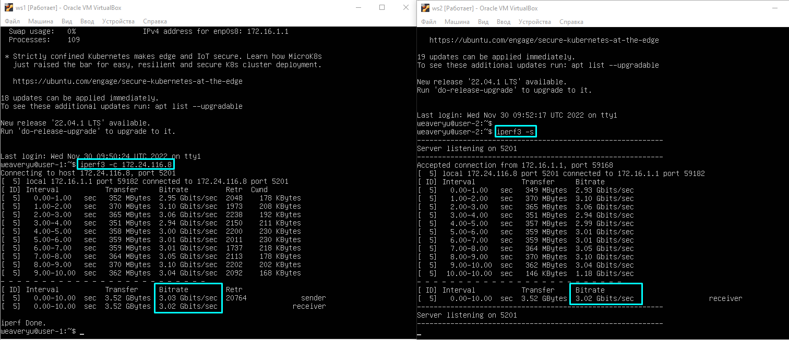

---
## Part 4. Сетевой экран

### 4.1. Утилита iptables

Содержимое файлов /etc/firewall.sh. Входящие пакеты от портов 22 и 80 по протоколу tcp разрешены. На ws1 подряд прописаны правила запрещающие и разрешающие echo-reply. На ws2 в разрешающем правиле прописан другой ключ (-I OUTPUT 1 вместо -A OUTPUT), который добавляет правило в начало цепи, вместо конца.

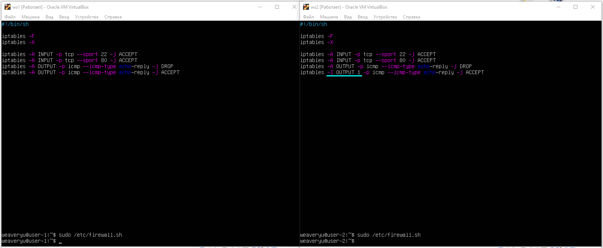

Сравниваем цепочки правил до и после выполнения скрипта. Видим, что на ws1 сначала идет запрещающее правило, а потом разрешающее. На ws2 наоборот.

Проверям пинг. ws1 не пингуется, ws2 пингуется.

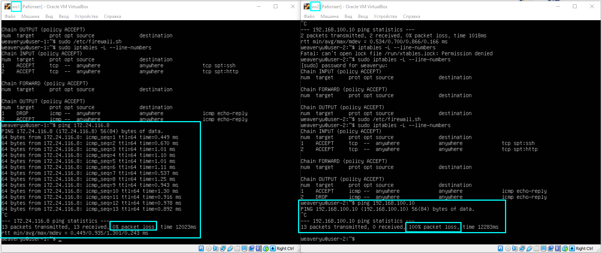

### 4.2. Утилита nmap

С помощью утилиты nmap удостоверяемся, что оба хоста запущены.

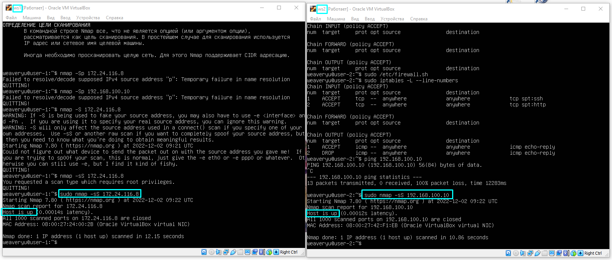

Делаем дамп образов виртуальных машин с помощью инструмена "Сделать снимок" в VirtualBox.

---
## Part 5. Статическая маршрутизация сети

### 5.1. Настройка адресов машин

С помощью графического интерфейса VirtualBox создаем 5 новых машин и в настройках соединяем их внутренними сетями по данной схеме. Вносим соответствующие настройки в конфигурационные файлы netplan.

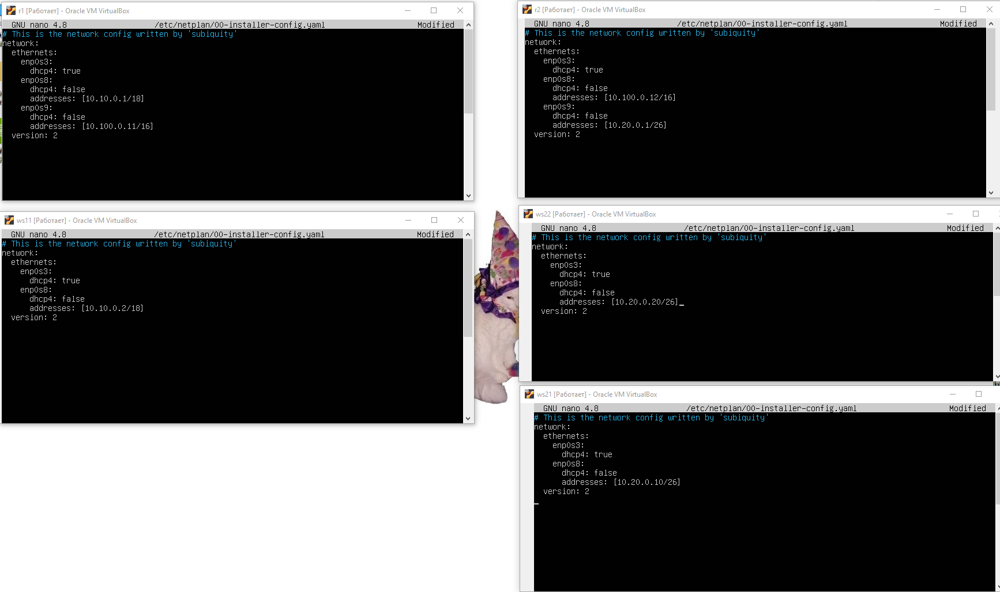

Перезапускаем службу сети и по выводу команды ip -4 a сверяем выставленные адреса со схемой. 

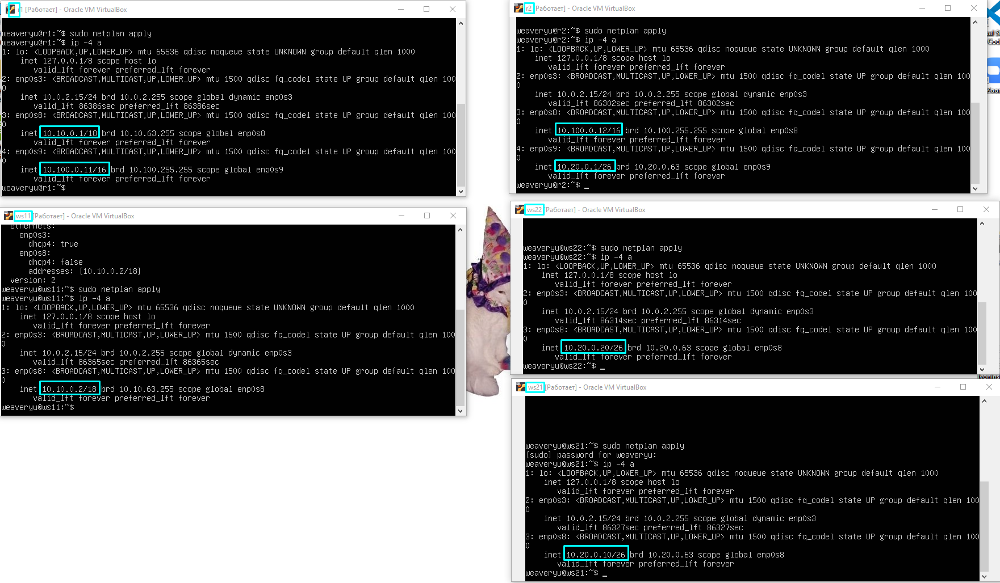

Пингуем ws11 с r1 и наоборот, также ws21 с ws22 и наоборот.

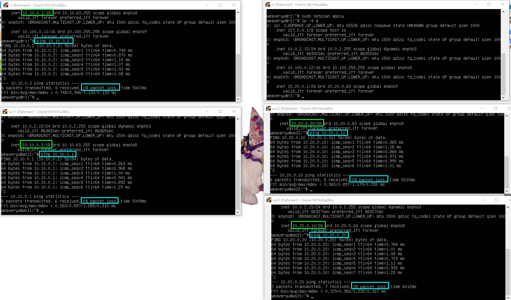

### 5.2. Включение переадресации IP-адресов

С помощью команды sysctl -w net.ipv4.ip_forward=1 включаем переадресацию ip-адресов.

Пробуем другой подход, который сохранится после перезагрузки. В файле /etc/sysctl.conf раскомментируем соответствующую строчку и сохраним файл.

Вывод команды ip r до добавления шлюза:

Изменения в конфигурационных файлах netplan. Добавляем маршрут до роутеров по умолчанию.

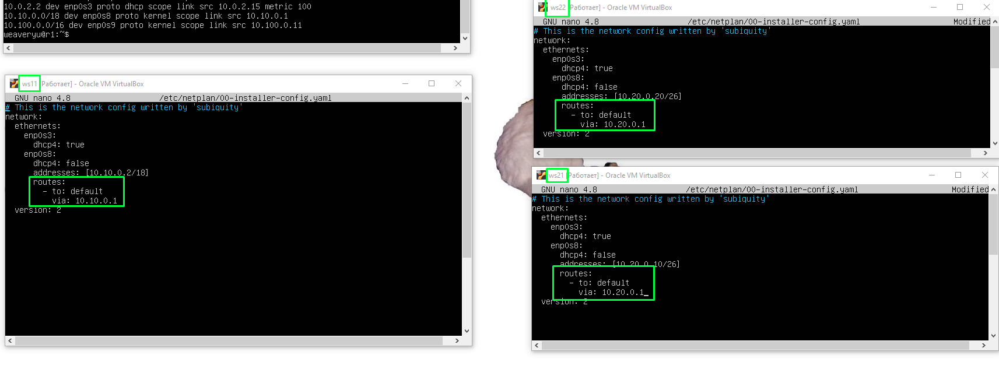

### 5.3. Установка маршрута по-умолчанию

Вывод команды ip r после добавления шлюза:

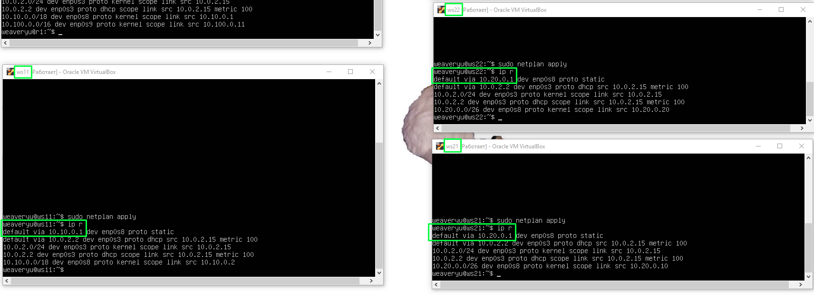

Результат пинга r2 с ws11. Командой tcpdump -tn -i enp0s8 перехватываем на r2 отправленные пакеты с ws11, прошедшие через r1.

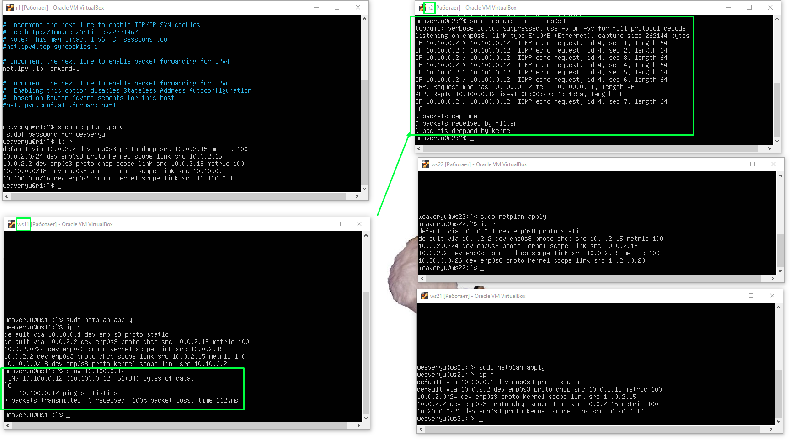

### 5.4. Добавление статических маршрутов

Добавленные статические маршруты в конфигурационные файлы роутеров:

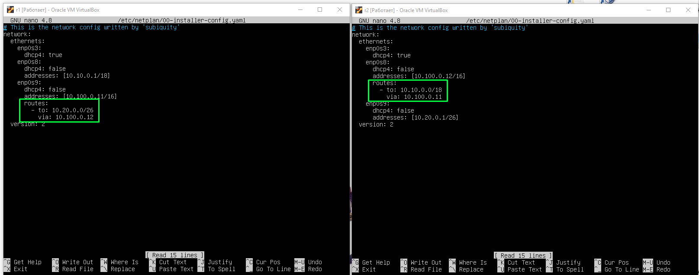

В выводе команды ip r видим, что теперь роутеры знают маршруты к каждой из локальных сетей.

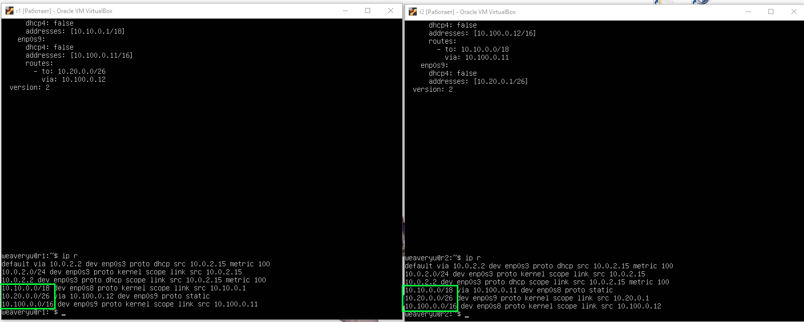

Выводы команды ip r list на машине ws11:

Выводы отличаются, потому что в случае с маршрутом до сети 10.10.0.0/18 машине не нужно обращаться к роутеру, она и так находится в этой сети.

> 0.0.0.0/0 - это немаршрутизируемый адрес IPv4, который можно использовать в разных целях, в основном, в качестве адреса по умолчанию или адреса-заполнителя.

### 5.5. Построение списка маршрутизаторов

Отслеженный маршрут от ws11 до ws21 утилитой traceroute:

Вывод команды tcpdump -tnx -i enp0s8, относящийся к traceroute:

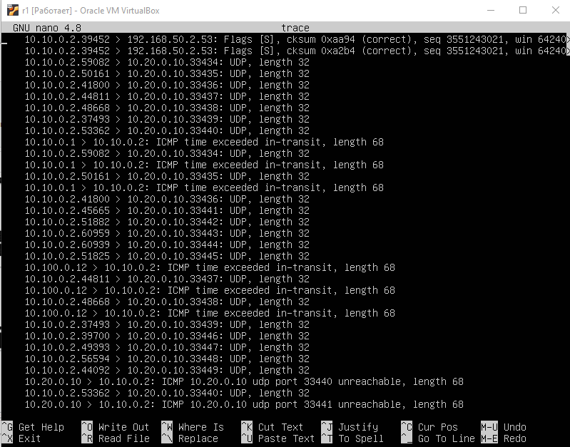

> Принцип работы traceroute:
>
>Утилита отправляет целевому узлу несколько пакетов с временем жизни 1 (TTL, time to live - число переходов, которые пакет может осуществить до своего исчезновения). Следующий маршрутизатор принимает пакеты и отправляет сообщение, что время жизни пакетов истекло. traceroute фиксирует адрес этого маршрутизатора и отправляет следующие пакеты, уже с TTL 2. Так, каждый раз увеличивая TTL на 1, traceroute составляет список маршрутизаторов, через которе прошли пакеты до целевого узла.

### 5.6. Использование протокола ICMP при маршрутизации

Пинг несуществующего айпи с ws11 и результат перехвата трафика на r1:

---
## Part 6. Динамическая настройка IP с помощью DHCP

Измененные файлы /etc/dhcp/dhcpd.conf и resolv.conf:

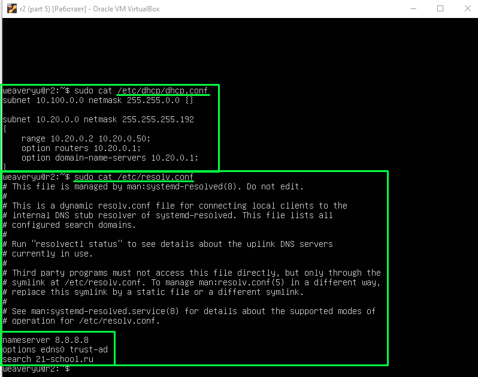

Оказалось, что isc-dhcp-server не установлена по умолчанию. Я установила ее, перезагрузила обе машины (r2 и ws21) и проверила статус службы на r2. Видим отчет о присваивании ws21 ip-адреса. В выводе команды ip a на ws21 видим, что адрес изменился. Пингуем ws22.

Те же опреации над r1 и ws11. В файл dhcpd.conf добавлено описание хоста ws11 и указан его mac-адрес. Чтобы сменить mac-адрес виртуальной машине, нужно не только прописать его в конфиге netplan, но и сообщить его VirtualBox во вкладке Сеть->Адаптер.

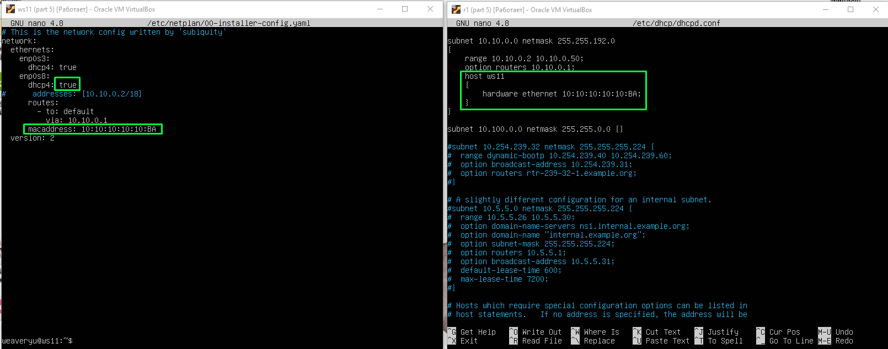

Перезагружаем машины, видим изменения и пингуем r1 с w11.

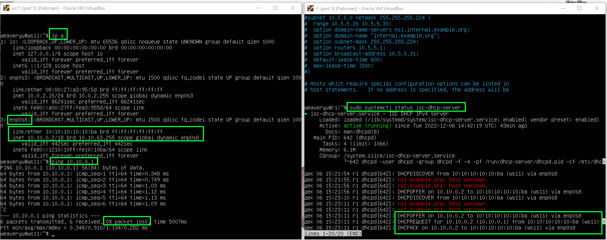

Команда для смены присвоенного ip - dhclient, утилита для управления адресом интерфейса по протоколу DHCP.

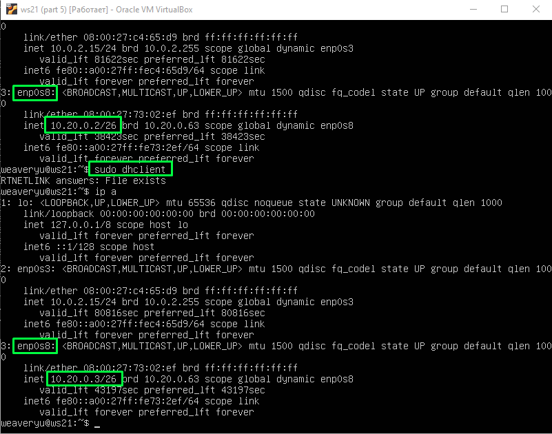

---
## Part 7. NAT

Я установила apache2 на r1 и ws22, затем отключила для виртуальных машин адаптер NAT.

Измененные ports.conf и запуск серверов Apache:

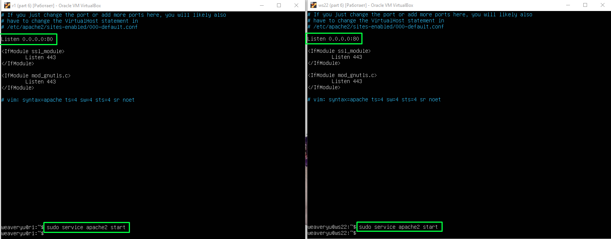

На следующих двух скринах содержимое скрипта для изменения фаервола на r2.

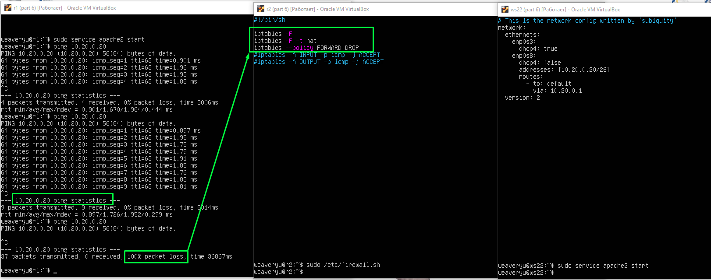

Сначала прописываем общую политику отбрасывать все маршрутизируемые пакеты, затем добавляем разрешение icmp-пакетов для прохода пинга. Без разрешения (на первом скрине) ws22 не пингуется r1, с разрешением (на втором скрине) пингуется.

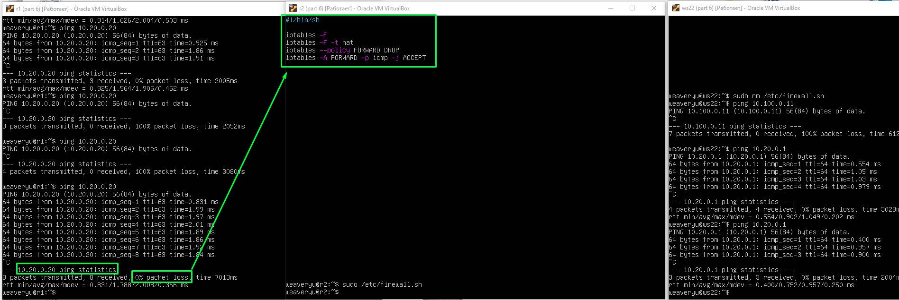

Для следующей части задания я разрешила проходить tcp-пакетам через r2 и добавила к настройкам apache2 на ws22 прослушивание 8080 порта. Прописанные для SNAT и DNAT строчки в скрипте представлены на скрине. r1 подключается к ws22 и наоборот.

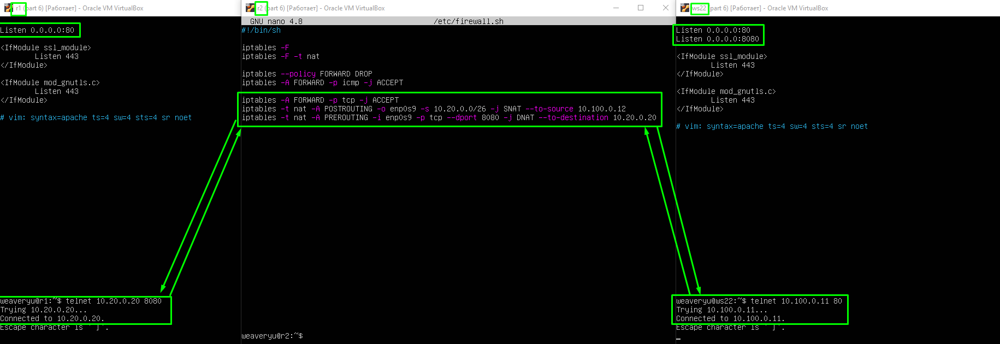

---
## Part 8. Дополнительно. Знакомство с SSH Tunnels

Измененный ports.conf на ws22 и команда на ws21 для подключения к порту 80 ws22 через порт 9999 ws21:

Открытый новый терминал на ws21 с помощью Alt + F2 и успешное подключение к серверу на ws22:

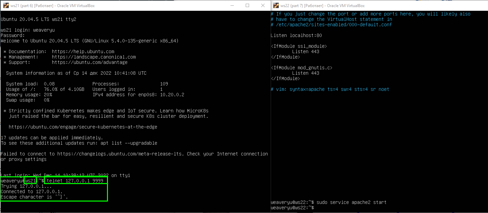

Подключение с порта 80 ws22 к порту 9999 ws11:

Теперь с ws11 можно подключиться к серверу на ws22.
